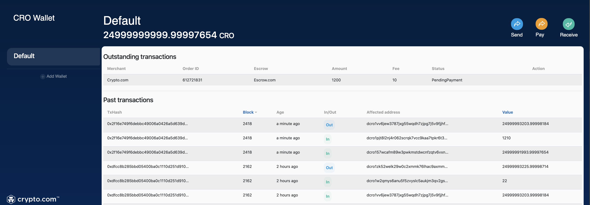
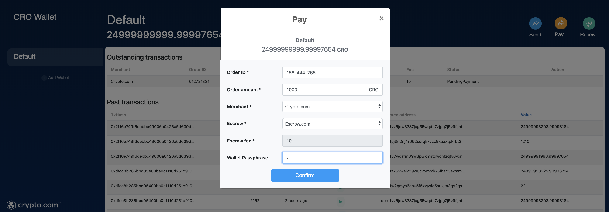
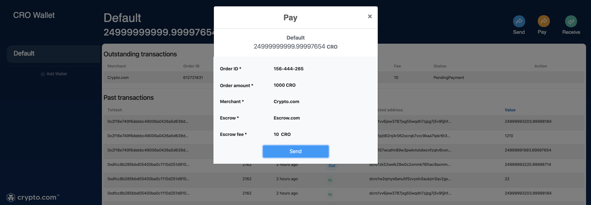
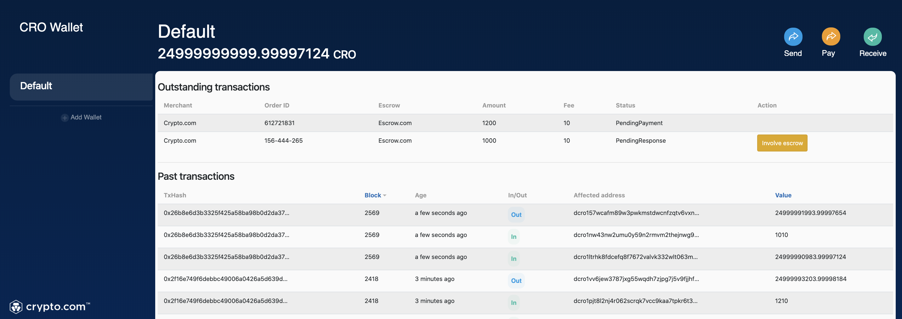
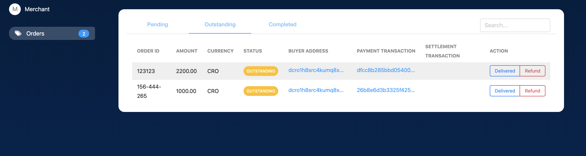

# PoGSD building instructions

## Customer side

- Please follow the [build instructions](https://github.com/crypto-com/multisig-demo#build-prerequisites) to set up the sample wallet and the merchant frontend. You will need to begin with the branch ``multi-sig-demo`` on the [sample wallet.](https://github.com/crypto-com/sample-chain-wallet/tree/multi-sig-demo)
Afterwards, you will find the "Pay" option on the top right corner as follows:

    

- Fill in the *order id* and *amount*; Choose the *Merchant* that you would like to pay and your perferred *Escrow service* provider.

    

- Confirm the detail and press "Send" to proceed. 

    

- Once the transaction was successfully broadcasted, you will be able to see the order in the *Outstanding transactions* list. You can contact the escrow service by clicking *"Involve Escrow"* for resolving a payment dispute.
 

    

## Merchant side 

- On the other hand, merchant can choose to mark the order as *"[Delivered](https://github.com/crypto-com/multisig-demo#scenario-a-the-item-is-shipped)"* or *"[Refund](https://github.com/crypto-com/multisig-demo#b1-reimbursement-without-escrow)"* the customer.

    

